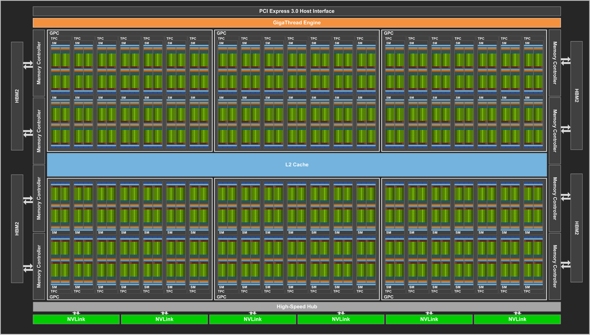
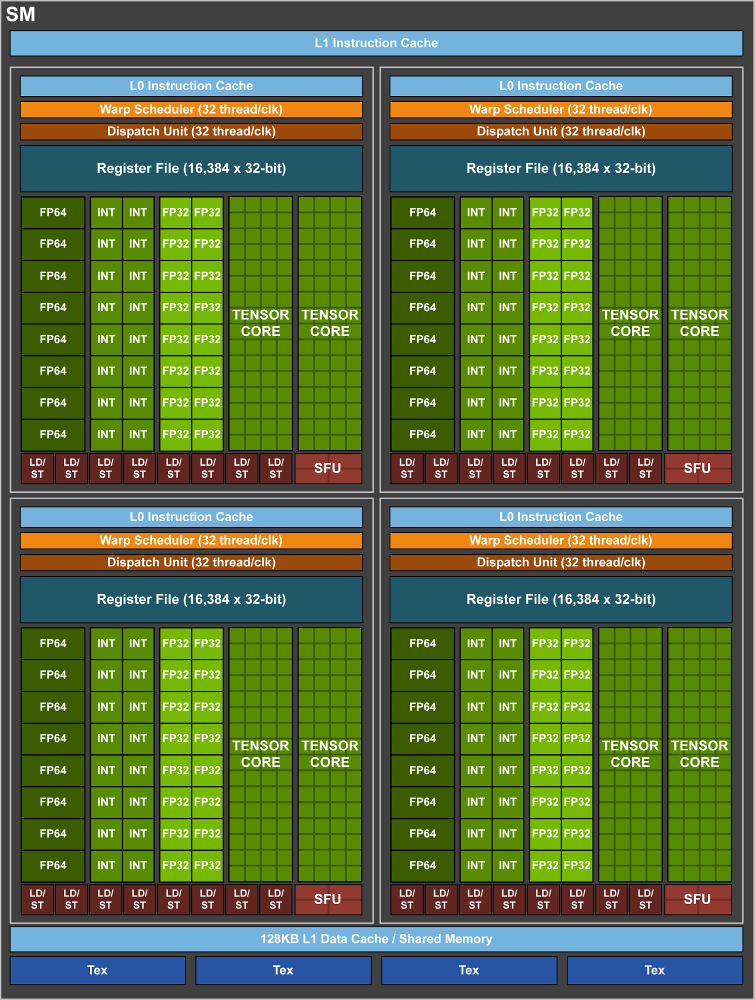

## A Closer Look at GPU Hardware Architecture
The GV100 is the GPU chip that the Tesla V100 data centre card is based on.

### Nvidia GV100 Block Diagram

This model of GPUs consists of:

| Graphics Processing Clusters (GPCs) |    6    |              |
| Streaming Multi-Processors (SMs)    |   84    | (14 per GPC) |
| L1 Cache (per SM)                   |  128 KB |              |
| L2 Cache                            | 6144 KB |              |

### Nvidia GV100 SM (Streaming Multi-Processor)
{: width="700px" }

| Type                                               | per SM | total |
| -------------------------------------------------- | ------:| -----:|
| 32 bit integer (INT32)  Cores                      |     64 | 5376  |
| single precision floating point (FP32)   Cores     |     64 | 5376  |
| double precision floating point (FP64)   Cores     |     32 | 2688  |
| Tensor Cores (work on matrices instead of vectors) |      8 |  672  |

## Running device diagnostics

Let's run some device diagnostics on a V100 GPU to print out some of its properties:

> ## Device diagnostic code `device_diagnostic.cu`
> 
> This is the code for `device_diagnostic.cu` that can also be downloaded from:
> https://raw.githubusercontent.com/acenet-arc/ACENET_Summer_School_GPGPU/gh-pages/code/07-architecture/device_diagnostic.cu
>
> ~~~~
> /*
> compile with
> 
> module load cuda
> nvcc device_diagnostic.cu  -o device_diagnostic
> */
> 
> #include <cstdio>
> 
> int main( void ) {
>     cudaDeviceProp  prop;
> 
>     int count;
>     cudaGetDeviceCount( &count);
>     printf("found %d CUDA devices\n",count);
>     for (int i=0; i< count; i++) {
>         cudaGetDeviceProperties( &prop, i );
>         printf( "   --- General Information for device %d ---\n", i );
>         printf( "Name:                     %s\n", prop.name );
>         printf( "Compute capability:       %d.%d\n", prop.major, prop.minor );
>         printf( "Clock rate:               %d\n", prop.clockRate );
>         printf( "Device copy overlap:      " );
>         if (prop.deviceOverlap)
>             printf( "Enabled\n" );
>         else
>             printf( "Disabled\n");
>         printf( "Kernel execution timeout: " );
>         if (prop.kernelExecTimeoutEnabled)
>             printf( "Enabled\n" );
>         else
>             printf( "Disabled\n" );
> 
>         printf( "   --- Memory Information for device %d ---\n", i );
>         printf( "Total global mem:         %ld\n", prop.totalGlobalMem );
>         printf( "Total constant Mem:       %ld\n", prop.totalConstMem );
>         printf( "Max mem pitch:            %ld\n", prop.memPitch );
>         printf( "Texture Alignment:        %ld\n", prop.textureAlignment );
> 
>         printf( "   --- MP Information for device %d ---\n", i );
>         printf( "Multiprocessor count:     %d\n",
>                     prop.multiProcessorCount );
>         printf( "Shared mem per mp:        %ld\n", prop.sharedMemPerBlock );
>         printf( "Registers per mp:         %d\n", prop.regsPerBlock );
>         printf( "Threads in warp:          %d\n", prop.warpSize );
>         printf( "Max threads per block:    %d\n",
>                     prop.maxThreadsPerBlock );
>         printf( "Max thread dimensions:    (%d, %d, %d)\n",
>                     prop.maxThreadsDim[0], prop.maxThreadsDim[1],
>                     prop.maxThreadsDim[2] );
>         printf( "Max grid dimensions:      (%d, %d, %d)\n",
>                     prop.maxGridSize[0], prop.maxGridSize[1],
>                     prop.maxGridSize[2] );
>         printf( "\n" );
>     }
> }
> ~~~~
> {: .language-c }
{: .solution}

~~~~
$ cd ~/scratch
$ mkdir diagnostics
$ cd diagnostics
$ wget https://raw.githubusercontent.com/acenet-arc/ACENET_Summer_School_GPGPU/gh-pages/code/07-architecture/device_diagnostic.cu
$ nvcc device_diagnostic.cu  -o device_diagnostic
$ srun --time=5 --gres=gpu:1  ./device_diagnostic
~~~~
{: .language-bash }

~~~~
$ srun --time=5 --gres=gpu:1  ./device_diagnostic
found 1 CUDA devices
   --- General Information for device 0 ---
Name:                     Tesla V100-PCIE-32GB
Compute capability:       7.0
Clock rate:               1380000
Device copy overlap:      Enabled
Kernel execution timeout: Disabled
   --- Memory Information for device 0 ---
Total global mem:         34079637504
Total constant Mem:       65536
Max mem pitch:            2147483647
Texture Alignment:        512
   --- MP Information for device 0 ---
Multiprocessor count:     80
Shared mem per mp:        49152
Registers per mp:         65536
Threads in warp:          32
Max threads per block:    1024
Max thread dimensions:    (1024, 1024, 64)
Max grid dimensions:      (2147483647, 65535, 65535)
~~~~
{: .output }

### Compute Capability
The `Compute capability` is represented by a version number (sometimes called the "_SM version_"), that 
identifies the features supported by the GPU chip can can be used by the software.

By default `nvcc` will compile the code for all supported architectures. However if you know which 
generation of GPUs your code will be running on, you can restrict the compiler to target only 
one or a specific list of architectures.
For example, you can use `nvcc --arch=compute_70 ...` to compile only for compute capability 7.0,
which will only run on those GPUs supporting at least this version.

~~~
$ nvcc --arch=compute_70 mycode.cu
~~~
{: .language-bash }

More information on compute capability can be found:
* In the [CUDA C Programming Guide](https://docs.nvidia.com/cuda/cuda-c-programming-guide/index.html#compute-capability) 
  which lists the various features and the version in which they are available.
* The following page lists all different models of Nvidia GPUs with their Compute capability version: 
  https://developer.nvidia.com/cuda-gpus

### Multiprocessor Count
The V100 card reports having 80 Multiprocessors (SMs).
But if the V100 is based on the GV100 chip that is supposed to have 84 SMs. Where are the remaining 4 SMs?

The answer to that lies in the practicalities of manufacturing. The GV100 chip consists of more than
20 billion transistors that are produced in a "12 nm" process. With so many elements being produced 
with such fine details, it is extremely difficult to get a chip that has no defects.
During production, each all SMs of each individual chip are tested and SMs with defects are disabled.

For the V100 cards, Nvidia is using chips with 4 disabled SMs, some of which likely have defects.
Chips that need to have more defective SMs disabled can still be used for lower tier products.

Overall this is done to increase the _yield_ of usable chips during manufacturing.
Comparable strategies are used by other chip-manufacturers as well.

### Shared Memory per Multiprocessor
[Shared Memory](https://docs.nvidia.com/cuda/cuda-c-programming-guide/index.html#shared-memory)
is a special kind of memory within each multiprocessor, that is much faster than global (GPU) 
memory.  It can be used to store a block of data that the current threads need to be working on directly 
in the multiprocessor, reducing wait-times due to inefficient reads from global memory.
The downside is, that shared memory needs to be managed manually.

### Threads in warp (Warp Size)
As mentioned in the episode [Using blocks in stead of threads](../05-using-blocks/), each 
Multiprocessor creates, manages and executes threads in groups of 32 parallel threads called warps.
All threads of a warp always have consecutive thread-IDs and always start together.

A warp always executes one common instruction at a time.  This means that best efficiency is achieved 
when all threads in a warp follow the same code-path. When some threads branch off to a different 
code-path than the rest, for example at an if-else clause, the multi-processor first continues with 
those threads that follow one path, temporarily disabling the others and going back to finish them later.

This is an important behaviour of [SIMT (Single-Instruction, Multiple-Thread) architecture](https://docs.nvidia.com/cuda/cuda-c-programming-guide/index.html?highlight=shared%20memory#simt-architecture).

### Maximum Number of Threads per Block
This is the maximum number of threads that can be used in a single block, i.e. 
the `blockSize` in this example:
~~~
my_kernel<<<numBlocks, blockSize>>>(...);
~~~
{: .language-c}

This maximum block size has been at 1024 for compute capability >= 2.0.
Though Nvidia may decide to increase the limit sometime in the future.

### Maximum Thread Dimensions
So far we have only used a single dimension for threads (`threadIdx.x`), however
CUDA also allows us to index our threads using three dimensions: `threadIdx.x`, 
`threadIdx.y` and `threadIdx.z`.

What `Max thread dimensions: (1024, 1024, 64)` tells us the maximum dimensions in x, y and z,
however the product of these may never exceed the maximum number of threads.
This means that with `Max threads per block: 1024` and `Max thread dimensions: (1024, 1024, 64)`,
we could (among others) use the following block configurations:

* 1024 x 1 x 1 = 1024
* 1 x 1024 x 1 = 1024
*  256 x 2 x 2 = 1024
*  4 x  4 x 64 = 1024
* 16 x  8 x  8 = 1024
