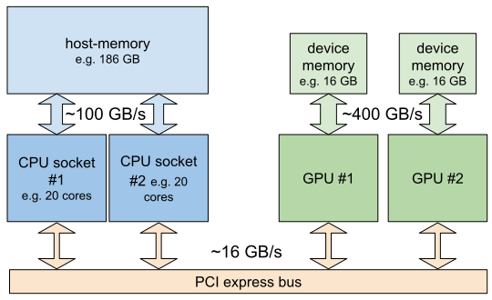
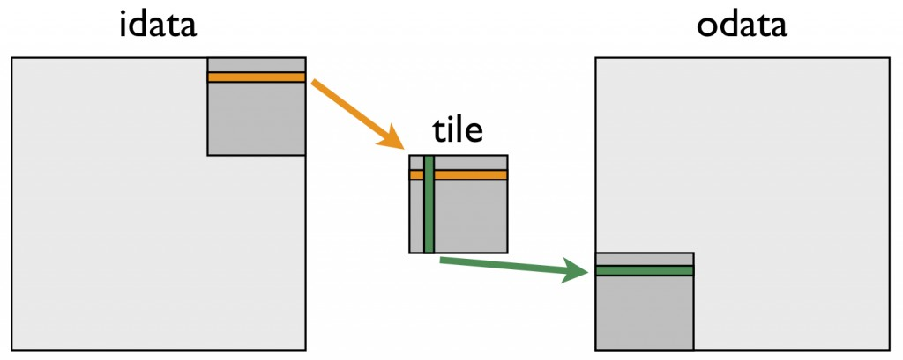

## Bandwidth Limitations When Copying Between Host and Device

The bandwidth to transfer data between host-memory (CPU-memory) and device-memory (GPU-memory) is about a order of magnitude lower than the memory transfer rate between CPUs and the host-memory. The transfer rate between GPUs and the device-memory is often significantly higher than that for CPUs.

{: width="700px" }

Therefore it is not uncommon that the memory transfer makes up a large fraction of the total runtime of a GPU accelerated calculation. In order to have an overall improvement of performance, the speedup achieved by the GPU over the CPU, must be large enough to offset the required data transfer.

* Memory transfers between host and device should be kept as minimal as possible.
* Using [Page-Locked Host memory (also called pinned memory)](https://docs.nvidia.com/cuda/cuda-c-programming-guide/index.html#page-locked-host-memory) can help a bit.
* Using [asynchronous transfers](https://docs.nvidia.com/cuda/cuda-c-programming-guide/index.html#overlap-of-data-transfer-and-kernel-execution) (overlapping computation and transfer) also helps.

## Consecutive memory access patterns

When a CPU or GPU accesses a memory address, the memory controller always fetches a whole block of data, that contains the requested address, which then is kept in a faster cache very close to the processor.
Therefore when in the processor wants to access the next element, it is often already available in the cache and the slower memory-access can be avoided.

Therefore it is better for adjacent threads (i.e. those belonging to the same warp) to access
locations consecutive memory addresses (or as close as possible).

* Thread `i` accessing global memory array at `a[i]` is a GOOD access pattern. 
* Thread `i` accessing global memory array at `a[i*nstride]` is a BAD access pattern. 

> ## Exercise: Memory access patterns
>
> Is this a a good memory access pattern?
>
> ~~~
> x = blockIdx.x * blockDim.x + threadIDx.x;
> y = blockIdx.y * blockDim.y + threadIDx.y;
>
> b[x*n+y] = a[x*n+y];
> ~~~
> {: .language-cpp }
>
> > ## Solution
> > No, this pattern is not efficient. Neighboring threads within a warp will increment `threadIDx.x`, therefore
> > variable `x` increments by one between threads in the same warp.  In this example `x` is multiplied by `n`.  
> > To illustrate this, let's look at the indices for $$ x = 0, 1, 2 $$:
> > ~~~
> > x = 0: a[0*n+y]
> > x = 1: a[1*n+y]
> > x = 2: a[2*n+y]
> > ~~~
> > {: .source }
> > So between each value of x, the index jumps by a factor of `n` (`n` and `y` are constant among threads in the same warp).
> > If however we use this expression instead:
> > ~~~
> > b[x+n*y] = a[x+n*y];
> > ~~~
> > memory is accessed in a coalesced way, minimizing cache-misses.
> > {: .language-cpp }
> {: .solution }
{: .challenge }

### Shared memory
In cases where consecutive memory access is not possible, using [shared memory](https://docs.nvidia.com/cuda/cuda-c-programming-guide/index.html#shared-memory) may provide significant speedup.

Each multiprocessor (SM) has a special, so-called called shared memory, that is small (only 64 KB) but fast, that can be used by all cores of the SM and that needs to be managed by the programmer.

Using Shared memory is out of the scope of this workshop, but generally, it can be filled with e.g. a tile of a global memory array, which can then be accessed in a non-consecutive way without performance penalty, as long as the reads and writes from and to global memory remain consecutive.

An often used example for a problem where a naive approach would use either non-consecutive reads or writes is the matrix transpose, where the rows of an input matrix are converted onto columns of an output matrix.

{: width="512px" }

By loading a tile of the matrix into shared memory, both the reads and the writes to global memory can remain consecutive.

The example of the [matrix transpose](https://developer.nvidia.com/blog/efficient-matrix-transpose-cuda-cc/) is discussed further on the Nvidia Developer Blog.
The CUDA C programming guide explains the use of [shared memory](https://docs.nvidia.com/cuda/cuda-c-programming-guide/index.html#shared-memory) by performing a matrix multiplication.

> ## Shared memory bank conflicts 
> Shared memory is organized into equally sized modules (banks) that can be accessed simultaneously.
> However if multiple threads want to access memory-addresses that are located in the same bank, these accesses
> cannot happen at the same time.
> The following articles discuss how to deal and avoid bank conflicts:
> * https://developer.nvidia.com/blog/using-shared-memory-cuda-cc/
> * https://developer.nvidia.com/blog/efficient-matrix-transpose-cuda-cc/#shared_memory_bank_conflicts
{: .callout }
